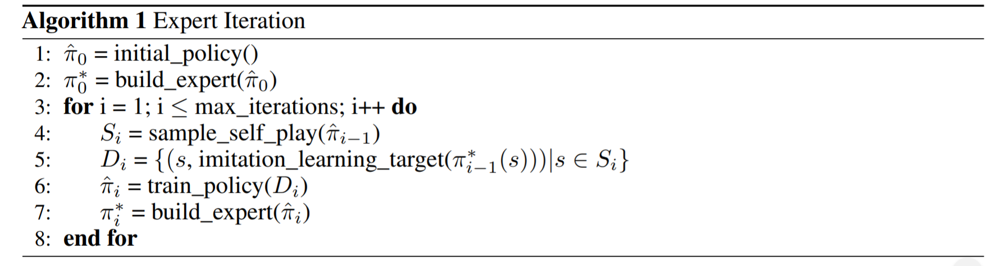

# Imitation learning with the EXIT algorithm
### Exit Algorithm

- Expert used: Monte Carlo Tree Search 
- Update expert by using the neural network as the value function to do rollout
- Train policy on Di is equivalent to computing loss and optimizing the neural network (with state action, we compute the reward)
- Basically how the whole thing works is:
    1. We have an apprentice (Value-NN) and expert (MCTS)
    2. Initialize the neural network and MCTs (with neural network passed to it)
    3. For each iteration, apprentice generates a set of states
    4. Collect a set of D of (state, expert_action)
    5. Expert action can be calculated by doing rollouts with the apprentice neural network
    6. Update the neural network with D: compute loss and train
    7. Pass the new neural network to MCTs -> Expert update

## TODO-List
- [ ] Compute loss function for neural network:
    1. Input: Previous Apprentice, Updated Apprentice after learning from expert
    2. Calculate the reward loss using huberloss. Refer to HW3 compute loss function
- [ ] Optimize function to train the neural network
- [ ] Incorporate speed range to make state somewhat markov
- [ ] Test the neural network on different configurations: Train the model based on environment and then run test